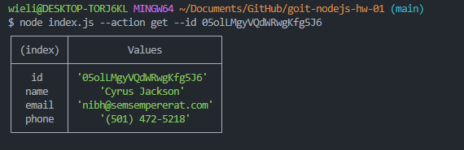

# Otrzymujemy i wyprowadzamy całą listę kontaktów w postaci tabeli (console.table)

node index.js --action list

# Otrzymujemy kontakt po id

node index.js --action get --id 05olLMgyVQdWRwgKfg5J6

# Dodajemy kontakt

node index.js --action add --name Mango --email mango@gmail.com --phone 322-22-22

# Usuwamy kontakt

node index.js --action remove --id qdggE76Jtbfd9eWJHrssH

